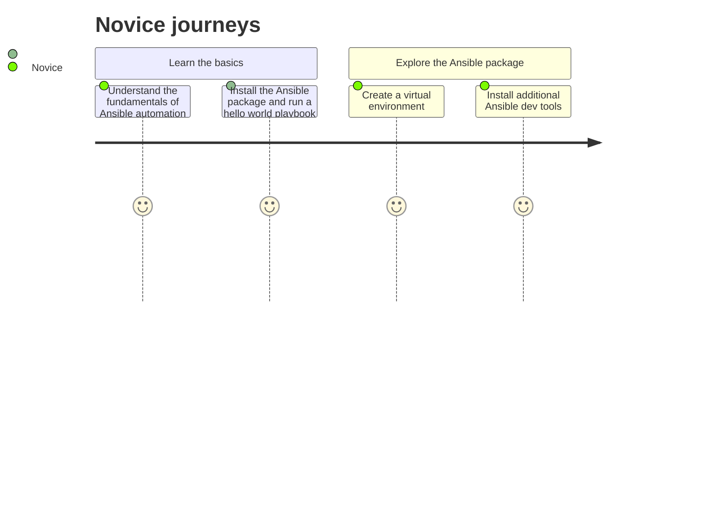
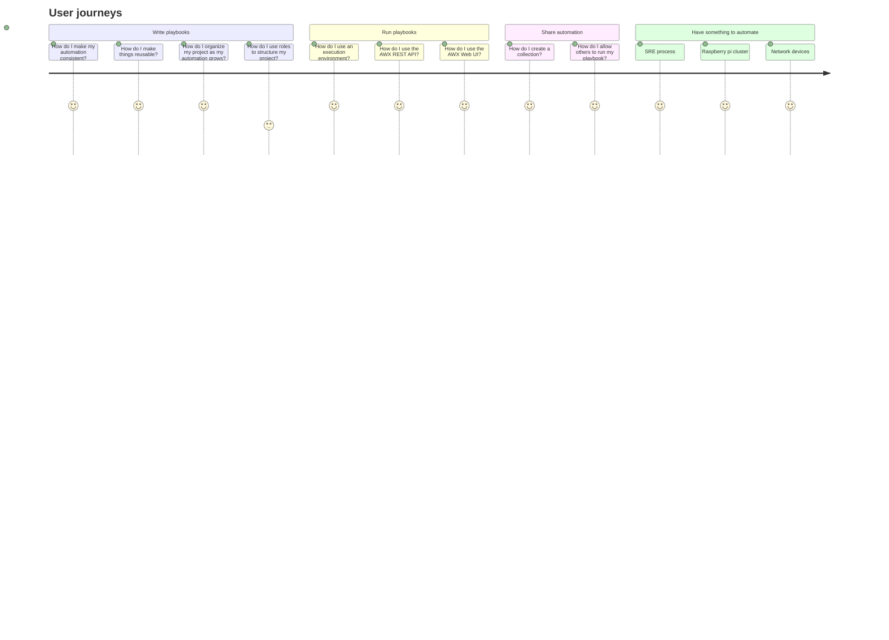

# Ansible user journey maps

This document extends Ansible personas by identifying and describing their major steps on user automation journeys.

Ansible community personas: https://hackmd.io/pZb5w5JFRQW3RJ73n23tlw?both#/

## Novice

## User

### Beginner tasks

- Sets up Ansible environment with vsCode plugins
- Installs and/or updates ansible or ansible-core
- Installs or updates individual collections
- Creates and tests playbooks
- Creates inventories
- Tests, publishes, and maintains all of these 

### Intermediate tasks

- Improves playbook quality (ansible-lint, handlers, etc)
- Creates roles
- Creates job templates (for AWX users)
- Uses event-driven automation (ansible-rulebook - new)
- Contributes to collections (bugfixes, modules etc)
- Tests, publishes, and maintains all of these

### Advanced tasks
- Manages multiple playbooks, inventories, and jobs with AWX
- Improves role quality with ansible molecule
- Creates execution environments with ansible-builder and ansible-navigator

## Operations

## Developer

### Beginner tasks
 - Reviews code of conduct and contributor guidelines for project of interest
 - Sets up development environment with vsCode plugin(s)
 - Fixes issues in existing project, collection, or module
 - Reviews PRs for project of interest
 - Creates module or plugin for local use

### Intermediate tasks
- Adds new feature to an existing project
- Develops a dynamic inventory plugin
- Adds a new module to an existing collection
- Converts a role into a collection
- Deprecates a module within a collection

### Advanced tasks
- Creates new Ansible project to provide new functionality to the ecosystem
- Creates collections (reusable plugins, roles, and playbooks)
- Troubleshoots collections with ansible-navigator
- Requests a collection be added to the Ansible package
- Creates execution environments (collections, libraries, and ansible-core version)
- Tests, publishes, and maintains all of these

## Community maintainer
- Follows all community-related discussions in their area and participates in decisions
- Maintains repository, including CI tests, PR reviews and merges
- Ensures important issues are fixed
- Releases project/collections regularly
- Actively acts to build a growing and welcoming community of contributors

## Community member/evangelist

## Novice
- Learns about  the community and reviews the code of conduct
- Joins community discussions for areas of interest (matrix, forum)
- Participates in a meetup or other local event
- Contributes to Ansible projects in GitHub (code, documentation, reviews etc)

## Intermediate
- Presents at a meetup 
- Writes and shares blog post/video etc
- Contributes a feature/collection etc to an Ansible project

## Advanced
- Hosts a meetup
- Becomes maintainer of an Ansible project or collection
- Becomes member of Ansible steering committee