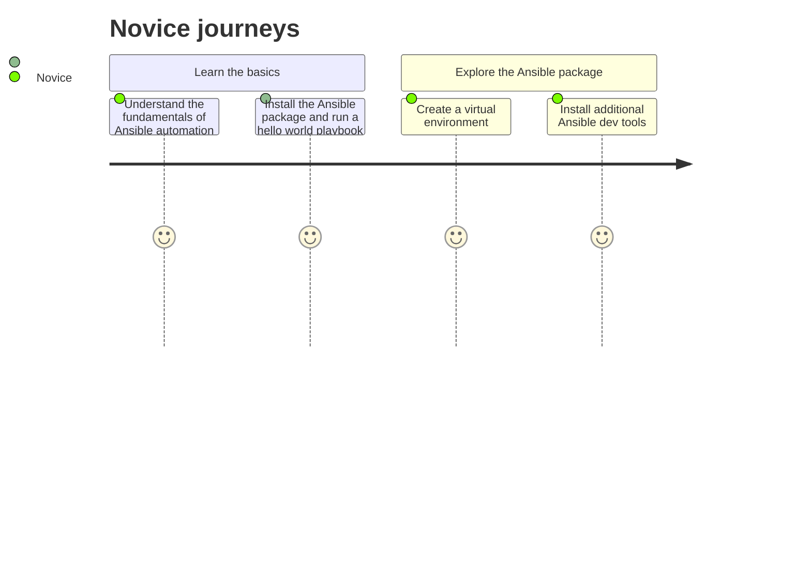
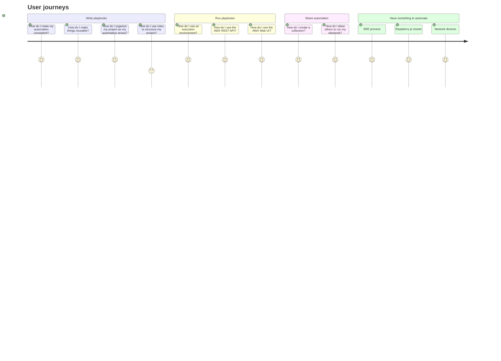

# Ansible user journey maps

This document extends Ansible personas by identifying and describing their major steps on user automation journeys.

Ansible community personas: https://hackmd.io/pZb5w5JFRQW3RJ73n23tlw?both#/

## Novice

## User

### Beginner tasks

- Installs and/or updates ansible or ansible-core
- Installs or updates individual collections
- Creates and tests playbooks
- Creates inventories
- Tests, publishes, and maintains all of these

### Intermediate tasks

- Creates roles
- Creates job templates (for AWX users)
- Uses event-driven automation (ansible-rulebook - new)
- Contributes to collections (bugfixes, modules etc)
- Tests, publishes, and maintains all of these

### Advanced tasks

- Creates collections (reusable plugins, roles, and playbooks)
- Creates execution environments (collections, libraries, and ansible-core version)
- Tests, publishes, and maintains all of these

## Operations

## Developer

## Community maintainer

## Community member

## Community evangelist